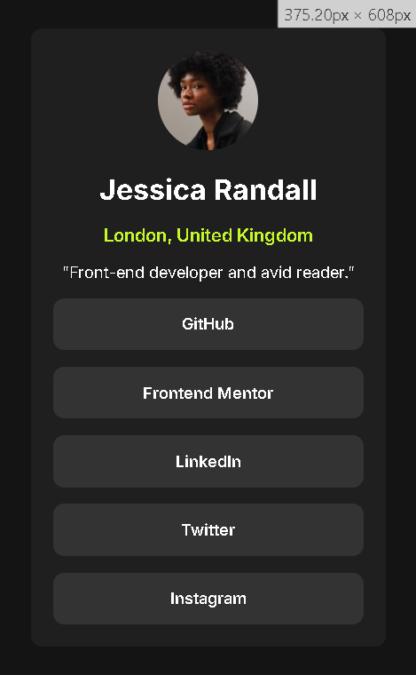

# Frontend Mentor - Social links profile solution

This is a solution to the [Social links profile challenge on Frontend Mentor](https://www.frontendmentor.io/challenges/social-links-profile-UG32l9m6dQ).

## Table of contents

- [Overview](#overview)
  - [The challenge](#the-challenge)
  - [Screenshot](#screenshot)
  - [Links](#links)
- [My process](#my-process)
  - [Built with](#built-with)
  - [What I learned](#what-i-learned)
  - [Useful resources](#useful-resources)
- [Author](#author)

## Overview

### The challenge

Users should be able to:

- See hover and active states for all interactive elements on the page

### Screenshot

Desktop View:

Mobile View:

### Links

- Solution URL: [GitHub Repository](https://github.com/ffozdemir/social-links-profile)
- Live Site URL: [Live Demo](https://ffozdemir.github.io/social-links-profile)

## My process

### Built with

- Semantic HTML5 markup
- CSS custom properties
- Flexbox
- Mobile-first workflow

### What I learned

During this project, I improved my skills in creating responsive designs and implementing hover effects. I particularly focused on making the social links accessible and visually appealing.

### Useful resources

- [CSS-Tricks Flexbox Guide](https://css-tricks.com/snippets/css/a-guide-to-flexbox/) - This helped me with layout organization.
- [MDN Web Docs](https://developer.mozilla.org/en-US/docs/Web/CSS/CSS_selectors) - Great resource for CSS selectors and pseudo-classes.

## Author

- Frontend Mentor - [@ffozdemir](https://www.frontendmentor.io/profile/ffozdemir)
- GitHub - [@ffozdemir](https://github.com/ffozdemir)
